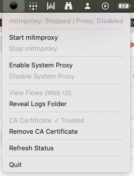

# mitmproxy-controller

A cross-platform **system tray** app for controlling [mitmproxy](https://mitmproxy.org/) and system proxy settings. Works on macOS (status menu) and Windows (system tray).

## Features

- **Start/Stop mitmproxy** - Launch or kill the mitmproxy process (uses mitmweb if available, falls back to mitmdump)
- **Enable/Disable System Proxy** - Configure system proxy to route traffic through mitmproxy (127.0.0.1:8899)
- **View Flows (Web UI)** - Open mitmweb interface in browser (port 8898) when mitmweb is running
- **Reveal Logs Folder** - Open the logs directory containing flow captures (`.mitm` files)
- **Install CA Certificate** - One-click installation of mitmproxy CA cert for HTTPS interception
- **Smart Menu Items** - Actions are disabled when not applicable (e.g., can't start if already running)
- **Auto-Refresh** - Status updates every 5 seconds via background polling
- **Manual Refresh** - "Refresh Status" menu item for immediate update
- **Status Indicator** - Tray icon shows current state:
  - 🟢 mitmproxy running + proxy enabled
  - 🟡 mitmproxy running + proxy disabled
  - 🟠 mitmproxy stopped + proxy enabled
  - ⚫ both off

## UI

### macOS



*Windows UI coming soon.*

## Prerequisites

- **macOS** or **Windows**
- [Go 1.23+](https://go.dev/dl/)
- [mitmproxy](https://mitmproxy.org/) installed and available in PATH

## Installation

```bash
# macOS
brew install mitmproxy

# Windows (using winget)
winget install -e --id mitmproxy.mitmproxy
```

## Build

```bash
go build -o mitmproxy-controller
```

## Run

```bash
# macOS
./mitmproxy-controller

# Windows
mitmproxy-controller.exe
```

The app runs in the system tray (macOS: top-right, Windows: bottom-right).

## Folder Layout

```
mitmproxy-controller/
├── main.go              # Shared systray UI and menu handling
├── mitm.go              # Shared mitmproxy process control + logging
├── mitm_darwin.go       # macOS-specific process utilities
├── mitm_windows.go      # Windows-specific process utilities
├── proxy_darwin.go      # macOS proxy config (networksetup)
├── proxy_windows.go     # Windows proxy config (registry)
├── cert_darwin.go       # macOS CA certificate installation (Keychain)
├── cert_windows.go      # Windows CA certificate installation (certutil)
├── open_darwin.go       # macOS URL/file opening utilities
├── open_windows.go      # Windows URL/file opening utilities
├── go.mod               # Go module definition
├── go.sum               # Go dependencies lock
└── README.md
```

## How It Works

- Prefers **mitmweb** (web UI) if available, falls back to **mitmdump** (headless)
- Proxy listens on port **8899**, Web UI on port **8898**
- Flows are saved to `.mitm` files in `~/Library/Application Support/mitmproxy-controller/logs` (macOS) or `%APPDATA%\mitmproxy-controller\logs` (Windows)
- Keeps last 10 log files, automatically cleans up older ones
- Uses Go build tags for platform-specific code

### macOS
- Auto-detects active network interface via `route get default` → maps to service name
- Sets both HTTP and HTTPS proxy via `networksetup`

### Windows
- Configures proxy via Windows Registry (`HKCU\...\Internet Settings`)
- Calls WinINet API to notify applications of proxy changes
- App appears in the system tray (bottom-right)

## CA Certificate Management

For HTTPS interception, mitmproxy's CA certificate must be trusted by your system.

### Install & Trust

1. **Start mitmproxy** first (generates the CA cert in `~/.mitmproxy/`)
2. Click **"Install CA Certificate"** from the menu
3. **macOS**: Prompts for admin password, installs to System Keychain with SSL trust
4. **Windows**: Uses `certutil` to add to user's Root certificate store
5. **Restart your browser** after installation

### Remove Certificate

Click **"Remove CA Certificate"** to uninstall from system trust store.
- **macOS**: Removes trust settings and deletes from System Keychain
- **Windows**: Deletes from Root store using SHA1 thumbprint

### Menu States

| Menu Item | State | Action |
|-----------|-------|--------|
| "Install CA Certificate" | Not installed | Click to install & trust |
| "Trust CA Certificate" | Installed, not trusted | Click to apply trust (macOS) |
| "CA Certificate ✓ Trusted" | Fully trusted | Disabled (complete) |
| "Remove CA Certificate" | Installed or trusted | Click to remove |

## Notes

- **macOS**: Proxy and certificate configuration may require admin privileges
- **Windows**: No admin required for per-user proxy/certificate settings
- Visit `mitm.it` in browser to verify traffic is routing through mitmproxy

## Cross-Compilation

```bash
# Build for Windows (x64) from macOS/Linux
GOOS=windows GOARCH=amd64 go build -o mitmproxy-controller.exe

# Build for macOS (Apple Silicon) from Windows/Linux
GOOS=darwin GOARCH=arm64 go build -o mitmproxy-controller
```

## License

MIT
